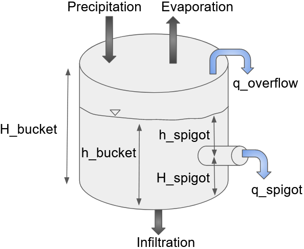

# DeepBucketLab

Neural network-based models are the current state-of-the-art for predicting current and future hydrological conditions. There is a need for formal training at the upper division and graduate level of hydrology education in neural networks for this purpose. We present a hands-on modeling tool for students in civil engineering and Earth science disciplines to help them learn the fundamentals of neural network methods for dynamic systems modeling, with particular emphasis on hydrological processes, and practice conceptual thinking in training an effective neural network model for hydrological prediction.

