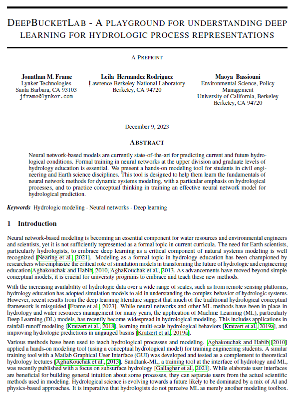

# DeepBucketLab

## Overview

DeepBucketLab is an interactive, hands-on tool designed to introduce students in civil engineering and Earth science disciplines to the fundamentals of neural network-based modeling, with a specific focus on hydrological processes. As neural networks become increasingly vital in predicting current and future hydrological conditions, there's a growing need for formal education in this area at the upper division and graduate levels. DeepBucketLab aims to fill this gap by providing a practical and educational platform for training effective neural network models for hydrological prediction.

## Features

- **Interactive Learning**: Engage with neural network concepts through hands-on modeling exercises.
- **Focus on Hydrology**: Specifically designed for understanding hydrological processes using state-of-the-art neural network models.
- **Practical Application**: Learn how to train and evaluate neural network models in a hydrological context.
- **Accessible Online**: Easily accessible through Binder, allowing for immediate, hassle-free usage without the need for local setup.

## Target Audience

- **Upper Division Students**: Ideal for students in advanced stages of civil engineering and Earth science programs.
- **Graduate Students**: A valuable resource for graduate students specializing in hydrology, environmental science, or related fields.
- **Educators**: A useful teaching tool for instructors in hydrology and environmental science.

## Getting Started

To start using DeepBucketLab, simply click on the Binder badge above. This will launch the interactive notebook in your browser, allowing you to begin experimenting with neural network models right away. 

### Running the lab on your own computer

#### Install the conda environment
If you have anaconda installed on your computer, you should install and activate the environment from the file `environment.yml` with the following commands:
1. `conda env create -f environment.yml`  
2. `conda activate deep_bucket_env`

#### Fully contained Jupyter Notebook
launch the following file in a Jypyter Notebook: `deep_bucket_lab.ipynb`

### More information
For more detailed instructions and documentation, please see our [technical description](./report/deep_bucket_lab.pdf).

### Advanced usage

Code for more advanced usage, including running your own interesting experiments, is split into several directories, each serving specific roles:

#### ./src/

Contains the clean, modular code for the project, divided into several scripts:  
  - `data_generation.py`: Generates synthetic data simulating a leaking bucket hydrologic response.  
  - `lstm.py`: Implements the LSTM deep learning model.  
  - `model_controller.py`: Manages model functions such as training and data normalization.  
  - `validation.py`: Executes model validation and computes performance statistics.  
  - `vizualization.py`: Provides functionality for visualizing data and predictions.  

#### ./run/

Includes Jupyter notebooks and scripts for direct execution of the model training and simulation:
  - `run_deep_bucket_lab_with_graphics.ipynb`: A Jupyter notebook with comprehensive visual outputs.
  - `run_deep_bucket_lab.py`: A script for running the model from the command line.

#### ./configuration/

Stores configuration files that dictate model parameters and settings.

#### ./experiments/

Hosts scripts designed to run specific experiments, such as testing model sensitivity to input noise.

#### Using the advanced code

To run the model, you can either open the Jupyter notebook in the run directory or execute the scripts from the command line in the main directory:
  - To start the Jupyter notebook with graphical outputs, navigate to `./runs/` and open `run_deep_bucket_lab_with_graphics.ipynb`.  
  - To train the model via command line: `python3 ./runs/run_deep_bucket_lab.py`.  
  - To conduct an experiment on noise sensitivity: `python3 ./experiments/noise_iteration.py`.  

## Citation Guide

### Suggested citation
J. M. Frame, L. Hernandez Rodriguez, and M. Bassiouni, "DeepBucketLab - A Playground for Understanding Deep Learning for Hydrologic Process Representations," DOI: 10.5072/zenodo.7349  

### Or else
For more information on how to cite DeepBucketLab in your research or publications, please refer to our [Citation Guide](./CITATION.md).

## Contributing

We welcome contributions from the community, especially if you have used the tool in an educational setting and have identified specific areas for improvement, whether it's adding new features, improving documentation, or reporting issues. For major changes, please open an issue first to discuss what you would like to change.
